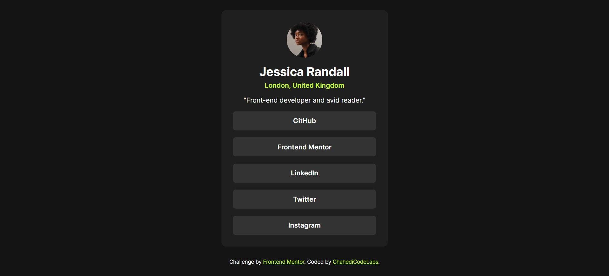

# Frontend Mentor - Social Links Profile Solution

This is a solution to the [Social Links Profile challenge on Frontend Mentor](https://www.frontendmentor.io/challenges/social-links-profile-UG32l9m6dQ). Frontend Mentor challenges help you improve your coding skills by building realistic projects.

## Table of contents

- [Overview](#overview)  
  - [The challenge](#the-challenge)  
  - [Screenshot](#screenshot)  
- [My process](#my-process)  
  - [Built with](#built-with)  
  - [What I learned](#what-i-learned)  
  - [Continued development](#continued-development)  
  - [Useful resources](#useful-resources)  
- [Author](#author)  
- [Acknowledgments](#acknowledgments)

## Overview

### The challenge

Users should be able to:

- See hover and focus states for all interactive elements on the page.

### Screenshot



## My process

### Built with

- Semantic HTML5 markup
- CSS custom properties
- Flexbox
- Mobile-first workflow

### What I learned

This project helped me strengthen my CSS layout skills, particularly with Flexbox, and practice building a responsive component. Here’s an example of a CSS snippet I’m proud of:

```css
main button:hover {
  background-color: hsl(75, 94%, 57%);
  color: hsl(0, 0%, 8%);
  cursor: pointer;
}
```

### Continued development

In future projects, I aim to:

Focus more on accessibility (e.g., using ARIA attributes for interactive elements).
Explore CSS Grid for more complex layouts.

### Useful resources

Frontend Mentor challenges - Helped improve my problem-solving skills with real-world projects.

## Author

Website - ChahediCodeLabs
Frontend Mentor - @ChahediCodeLabs

### Acknowledgments

Thanks to Frontend Mentor for providing such realistic challenges!